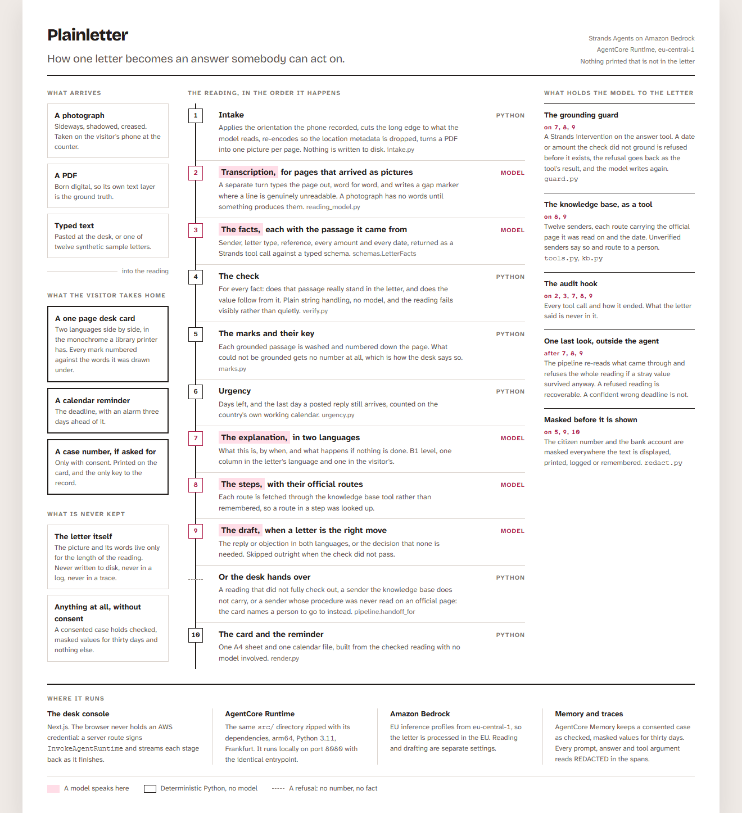

# Plainletter

**Every country sends its residents letters they cannot read.** A demand for money, a reference
number, a deadline, and a sentence about what happens if nothing is done, written in formal
language by a body you have never heard of. If you moved here last year, or you are eighty, or you
read the language slowly, that envelope is a closed door with a clock running behind it. Almost
every country answers this the same way: a free help desk, usually in a library, where somebody
sits down with you and your letter. The first ten minutes at that desk decide everything. What is
this. How bad is it. What happens if I ignore it. What exactly do I do, and by when.

Plainletter is the agent behind that desk. A volunteer, or the person holding the letter,
photographs or uploads it. Plainletter reads it, names the sender and the kind of letter, pulls out
every amount, reference number and deadline, explains it in plain language in the country's
language and in the reader's own, says what happens if nothing is done, lays out the next steps
with the official routes, drafts the reply or objection when that is the right move, says clearly
when a professional should take over, and prints a one page desk card the visitor takes home with a
calendar reminder for the deadline.

**It is built for one country properly rather than five countries approximately.** That country is
the Netherlands, which runs 861 of these desks in public libraries. The senders are the tax office,
the fine collection agency, the municipality, the benefits and pension agencies, the immigration
service, health insurers, the road authority and debt collectors. Everything specific to that
choice sits in [a short list of files](#what-is-specific-to-the-netherlands), and a test fails if
it leaks anywhere else.

Built with the [Strands Agents SDK](https://strandsagents.com/) on Amazon Bedrock, deployed on
Amazon Bedrock AgentCore in the EU (Frankfurt).

## How it works

<picture>
  <source media="(prefers-color-scheme: dark)" srcset="docs/architecture-dark.png">
  
</picture>

The diagram is drawn from [design/mockups/architecture.html](design/mockups/architecture.html) and
every file it names is in this repository.

## Nothing reaches the visitor that is not in the letter

The reading stage may return anything. What it returns then passes a verifier written in plain
Python that never calls a model: for every date, amount, reference and passage it checks that the
cited text really stands in the letter, and that the claimed value follows from that text. A
deadline whose passage says something else fails, and so does a passage the letter never carried.

Two more things sit behind it, one inside the agent and one outside. Every structured answer the
agents give is asked for as a Strands tool call, and every stage after the verifier runs with an
intervention on that boundary: an explanation, a plan or a draft carrying a date or amount the
check did not ground is refused before it exists, the refusal goes back to the model as the tool's
result, and the model writes again. The planner and the drafter also fetch the sender's official
routes through a tool rather than from the prompt, so a route in a step was looked up, and an audit
hook records every call and how it ended without recording what the letter said. The pipeline then
re-reads everything that came through and refuses the whole reading if a stray value survived
anyway. A refused reading at a help desk is recoverable; a confident wrong deadline is not.

The knowledge base marks each sender `verified` or not. Only a sender whose procedure was read on
an official page states a procedure; the rest say so and route the letter to a person.

## What the check runs against

A check is only as good as the text it checks against. A text upload carries the letter's words
already, and a born-digital PDF carries them in its text layer, which is pulled out locally before
any model sees the file. Those readings are checked against the document itself.

A photograph carries no words at all. There, one turn types the letter out and a separate turn
extracts the facts, and the facts are checked against the transcript the other turn produced. A
value the extractor invents has to also turn up in a transcription written without it.

## Where the letter comes in

Photographs arrive sideways and far larger than any model looks at, and they carry the coordinates
of the room they were taken in. Intake applies the orientation the phone recorded, cuts the long
edge to what the reading model actually reads, re-encodes every page so the location metadata is
dropped, and turns a PDF into one picture per page. Nothing is written to disk on the way.

## Run it

You need [uv](https://docs.astral.sh/uv/). It reads `.python-version` and fetches Python 3.11
itself, so that is the only thing to install, and the first command needs no cloud account.

```sh
uv sync --group dev
uv run plainletter demo --language uk --out out
```

That reads a synthetic traffic fine end to end with a scripted reading, so it needs no cloud
account, and writes `out/desk-card.html` and `out/reminder.ics`. There are twelve sample letters,
one for every sender in the knowledge base: `uv run plainletter demo --sample` lists them.

```sh
uv run plainletter read letter.jpg --language tr
uv run plainletter-serve
```

`read` takes a photograph, a PDF or a text file and runs the same pipeline against Amazon Bedrock
in `eu-central-1`, which needs credentials. `plainletter-serve` starts the AgentCore runtime
entrypoint on `127.0.0.1:8080`, the same one the deployed service runs, so the console can be
developed against it:

```sh
curl -s localhost:8080/invocations -H 'content-type: application/json' \
  -d '{"sample": "gemeente-parkeerboete"}'
```

The desk console and the landing page are a separate workspace:

```sh
npm install
npm run dev --workspace @plainletter/web
```

```sh
npm run verify:ship
```

is the single gate: types, the full test suite, whole-repo lint, and the committed floors.

## Deploy it

The deployed agent is the same `src/` directory zipped with its dependencies and run by Amazon
Bedrock AgentCore Runtime in Frankfurt, with a memory store beside it and its traces in AgentCore
Observability. `agentcore/agentcore.json` describes all three, `agentcore deploy` creates them,
and [docs/deploy.md](docs/deploy.md) is the whole procedure, including how the console is pointed
at the deployed runtime with one environment variable and how to check, in CloudWatch, that no
line of any letter ever reached a trace.

Two things about that deployment are decided in code rather than in configuration. The agent
masks every prompt, answer and tool argument in the spans Strands emits, by pinning the SDK's
redaction policy before its first agent is built (`src/plainletter/telemetry.py`), so a
deployment cannot forget it. And a reading is kept in AgentCore Memory only when the request says
the visitor consented: what is kept is the checked, derived and masked values under a case id the
desk card prints, never the letter, and it expires after thirty days
(`src/plainletter/memory.py`).

## Privacy

An official letter carries a name, an address, a national identity number, a bank account and a
debt. Plainletter is built so that almost none of that has anywhere to go.

- The picture and its text live only for the length of the reading. Nothing is written to disk, and
  the agents run with no console handler so no letter text reaches a log.
- The national identity number and the bank account are masked before anything is displayed,
  printed, remembered or sent to a trace, and the mask is applied again at the printer.
- Processing happens in `eu-central-1` through EU inference profiles.
- Nothing is remembered unless the visitor says so. A consented case holds checked, derived and
  masked values for thirty days: no name, no letter, no identity number.
- A case id is the only key to a case. It carries no personal data and cannot be looked up by name,
  but it is short enough to guess at, so the endpoint that reads one is metered: an origin check, a
  size cap, a per-address and per-browser burst limit and a daily ceiling in the console
  (`web/src/server/limits.ts`), and a second daily ceiling inside the agent, claimed before the
  first model call (`src/plainletter/spend.py`). Both counters live in the process that serves the
  request and say so; the ceiling that cannot be restarted is an account budget alarm, and setting
  one is part of deploying this.
- Every sample letter here is synthetic. The names, addresses, identity numbers and reference
  numbers were made up for this project.

Plainletter explains letters. It is not legal advice, and it says so on the card it prints.

## What is specific to the Netherlands

These are the files a second country would replace. Nothing else in `src/plainletter/` carries a
Dutch fact or a Dutch word.

| Path | What it decides |
|---|---|
| `src/plainletter/locales/nl.py` | How a date and an amount are written and read, which national number is masked, which days are public holidays, every word the desk card and the reminder print, and the body a volunteer refers a visitor to when the desk cannot finish |
| `src/plainletter/senders/*.yaml` | The twelve senders, each objection and payment route carrying the official page it was read on and the date it was read |
| `src/plainletter/samples/*` | Twelve synthetic letters and their recorded readings, used by the demo and the tests |
| `src/plainletter/reading_model.py` | The five prompts, which name the country and the language the letter is written in |

[`src/plainletter/locales/__init__.py`](src/plainletter/locales/__init__.py) is the whole list of
questions the rest of the package may ask about a country, and
[`tests/test_locale_boundary.py`](tests/test_locale_boundary.py) reads every module and fails the
build when a Dutch word appears outside the files above. Two exceptions are named in that test
rather than hidden: `dutch` is a field name in the structured-output schema the model fills, and
the amount reader assumes the euro.

Adding a country means writing one more file next to `nl.py`, a knowledge base for its senders, and
samples to prove it. It does not mean touching the reading, the check, the marks, the guard or the
renderer. That is the whole point of the boundary, and it is why the boundary is tested.

## Repository layout

| Path | What lives there |
|---|---|
| `src/plainletter/` | The agent: reading, verification, urgency, planning, rendering |
| `src/plainletter/locales/` | Everything that depends on which country the letter came from |
| `src/plainletter/senders/` | The curated sender knowledge base, one file per sender, sourced and dated |
| `src/plainletter/samples/` | Synthetic sample letters for the demo and the tests (no real people, no real data) |
| `web/` | The desk console and the public landing page |
| `agentcore/` | The AgentCore project: runtime, memory store and the CDK app that deploys them |
| `design/` | The committed art direction and the mockups every page derives from |
| `tests/` | Test suite |
| `scripts/` | Repository gates run in the pre-commit hook and in CI |
| `docs/` | Architecture, decisions, deployment |

## License

Apache-2.0. See [LICENSE](LICENSE).
